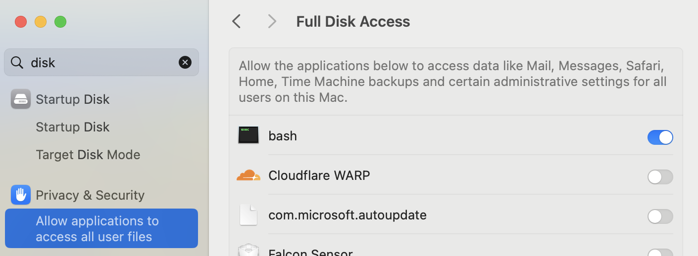

# December 18, 2024

- [[logseq]]
  - Migrated from obisidian
  - [[Git]]
    - https://github.com/CharlesChiuGit/Logseq-Git-Sync-101/
      - add hooks to git

        ```bash
        mkdir .githooks

        # add hooks to .githooks

        git config --local core.hooksPath .githooks/
        git add .githooks
        ```
- [[POSIX]]
  - Signals
    - `SIGHUP` - hangup
- [[Powershell]]
  - operates over object rather than text
  - Types of commands
    - cmdlets
      - are built on a common runtime using .net
    - native executables
    - functions
    - scripts
    - aliases
- [[Mac]]
  - [[Nix]]
    - Give full disk access to bash and nix for this error
      `Could not write domain com.apple.universalaccess; exiting`
      
  - Shortcuts
    - 3-finger swipe id:: 6762c2ad-dae5-4d42-a558-410c746d5672
      - up: Show Workspaces/Desktops
      - down: Select Desktop
      - left/right: move between
