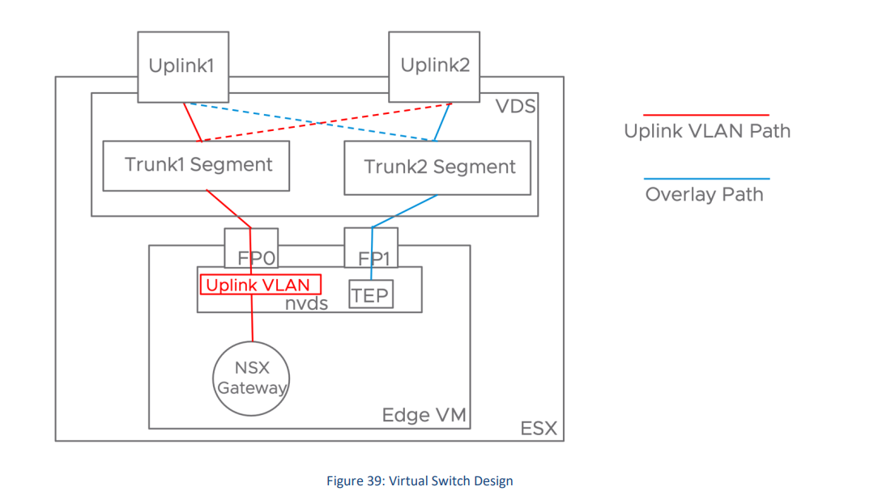

# July 14, 2025

- [[MCP]] #ai
  - architecture
    - {:height 526, :width 727}
  - MCP servers can provide three main types of capabilities:
    - **Resources**: File-like data that can be read by clients (like API
      responses or file contents)
    - **Tools**: Functions that can be called by the LLM (with user approval)
    - **Prompts**: Pre-written templates that help users accomplish specific
      tasks
  - What happens when a user sends prompts to a Client (e.g., Claude Desktop)
    - The client sends your question to Claude
    - Claude analyzes the available tools and decides which one(s) to use
    - The client executes the chosen tool(s) through the MCP server
    - The results are sent back to Claude
    - Claude formulates a natural language response
    - The response is displayed to you!
- [[VMWare]]
  - NSX
    - [NSX Easy Adoption Guide](https://community.broadcom.com/viewdocument/nsx-easy-adoption-design-guide?CommunityKey=b76535ef-c5a2-474d-8270-3e83685f020e&tab=librarydocuments)
    - {:height 477, :width 853}
      - Edge node can be a VM or a dedicated bare-metal server. It provides
        **network services** like routing, NAT, VPN, and load balancing.
      - ## Summary
        - **ESXi Host**
          - A physical server running VMs.
          - Has two network connections (Uplink1 and Uplink2) to the outside
            world.
        - **Virtual Switch (VDS)**
          - Like a power strip for network connections—connects VMs to the
            network.
        - **NSX Edge VM**
          - A special VM that acts like a router or firewall.
          - Helps VMs talk to the outside world and between different networks.
        - **TEP (Tunnel Endpoint)**
          - A virtual network port used to send traffic between hosts securely.
        - ### 🔄   **Two Types of Network Paths**
        - **Uplink VLAN Path (Red Line)**
          - Used for traffic going in/out of the data center (north-south).
          - Connects the Edge VM to the physical network.
        - **Overlay Path (Blue Line)**
          - Used for traffic between VMs across different hosts (east-west).
          - Uses tunnels to send data over the physical network.
      - ## Details
        - ### 🔧   **Key Components**
        - **Uplink1 & Uplink2**
          - These are physical NICs (pNICs) on the ESXi host.
          - They connect the host to the physical network infrastructure.
          - Each uplink is associated with a **trunk segment**, allowing
            multiple VLANs to traverse the same physical link.
        - **Trunk1 Segment & Trunk2 Segment**
          - These are logical network segments that carry VLAN-tagged traffic.
          - They are used to connect the **NSX Edge VM** to the physical network
            via the **Uplink VLAN Path**.
        - **Virtual Distributed Switch (VDS)**
          - A VMware vSphere component that provides centralized management of
            virtual network configurations across multiple hosts.
          - It connects VMs (like the Edge VM) to the physical network through
            the uplinks.
        - **Edge VM**
          - A virtual appliance that provides routing, NAT, VPN, and other
            network services in NSX-T.
          - It has two interfaces:
            - **FP0**: Connected to the physical network via the **Uplink VLAN
              Path** (red dashed line).
            - **FP1**: Connected to the NSX-T overlay network via the **Overlay
              Path** (blue dashed line).
        - **NSX Gateway**
          - Represents the logical router or gateway functionality provided by
            the Edge VM.
          - It connects the overlay network to the external physical network.
        - **TEP (Tunnel Endpoint)**
          - Used for encapsulating and decapsulating overlay traffic (Geneve
            protocol).
          - Facilitates communication between NSX-T transport nodes over
            the **Overlay Path**.

            ***
        - ### 🔄   **Traffic Paths**
        - **Uplink VLAN Path (Red Dashed Line)**
          - Connects the Edge VM’s FP0 interface to the physical network via
            VLAN trunking.
          - Used for north-south traffic (external communication).
        - **Overlay Path (Blue Dashed Line)**
          - Connects the Edge VM’s FP1 interface to the NSX-T overlay network.
          - Used for east-west traffic (VM-to-VM within the NSX domain).
