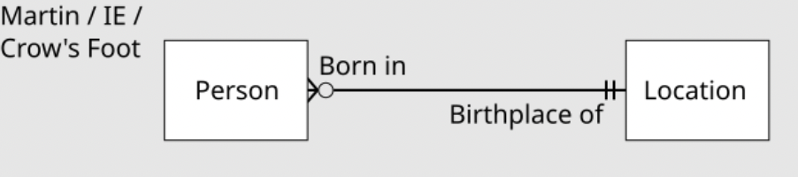

- [[Database]]
	- ER diagram
		- **Concept** [wikipedia](https://en.wikipedia.org/wiki/Entity%E2%80%93relationship_model)
			- 
				- ==each location== may have had zero or more people born in it.
				- ==each person== must have been born at one, and only one, location,
	-
	-
	-