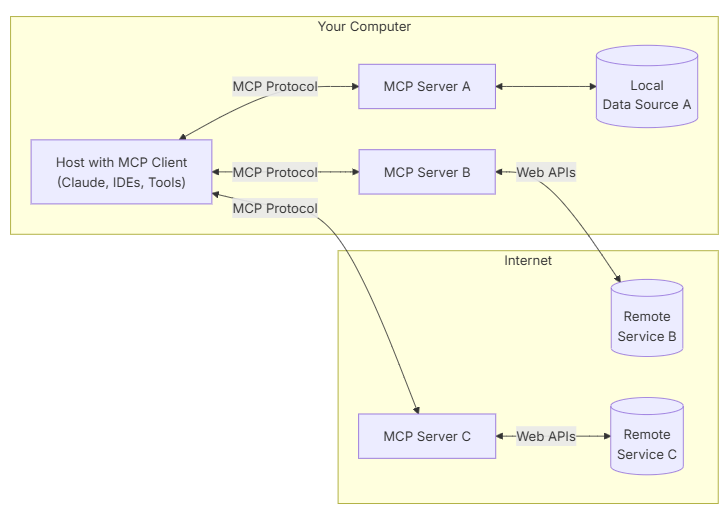

- [[MCP]] #ai
	- architecture
		- {:height 526, :width 727}
	- MCP servers can provide three main types of capabilities:
		- **Resources**: File-like data that can be read by clients (like API responses or file contents)
		- **Tools**: Functions that can be called by the LLM (with user approval)
		- **Prompts**: Pre-written templates that help users accomplish specific tasks
	- What happens when a user sends prompts to a Client (e.g., Claude Desktop)
		- The client sends your question to Claude
		- Claude analyzes the available tools and decides which one(s) to use
		- The client executes the chosen tool(s) through the MCP server
		- The results are sent back to Claude
		- Claude formulates a natural language response
		- The response is displayed to you!