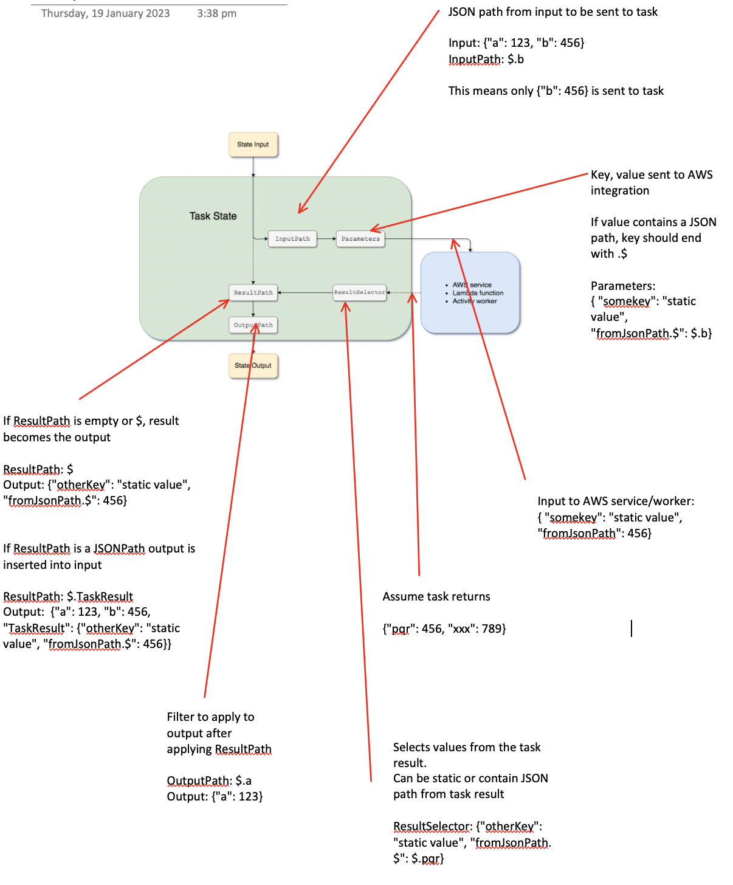

# AWS

## RDS

### IAM Auth

- MySQL

  Generate auth token:

  ```bash
  aws rds generate-db-auth-token \
    --hostname rds-cdata-preprod-v1.c9yv7rfnzgng.ap-southeast-2.rds.amazonaws.com \
    --port 3306 \
    --region ap-southeast-2 \
    --username master
  ```

  Connect to database:

  ```bash
  mysql \
    --host=rds-cdata-preprod-v1.c9yv7rfnzgng.ap-southeast-2.rds.amazonaws.com \
    --port=3306 \
    --ssl-ca=/root/global-bundle.pem \
    --enable-cleartext-plugin \
    --user=master \
    --password=<authToken>
  ```

## EC2

### Port Forwarding

```bash
aws ssm start-session \
  --target $instance_id \
  --document-name AWS-StartPortForwardingSession \
  --parameters '{"portNumber":["8080"],"localPortNumber":["8080"]}'
```

## Step Functions



### InputPath

JSON path from input to be sent to task.

Example:
- Input: `{"a": 123, "b": 456}`
- InputPath: `$.b`
- Result: Only `{"b": 456}` is sent to task

### Parameters

Key, value sent to AWS integration. If value contains a JSON path, key should
end with `.$`:

```json
{
  "somekey": "static value",
  "fromJsonPath.$": "$.b"
}
```

### ResultSelector

Selects values from the task result. Can be static or contain JSON path from
task result.

Assume task returns: `{"pqr": 456, "xxx": 789}`

```json
{
  "otherKey": "static value",
  "fromJsonPath.$": "$.pqr"
}
```

### ResultPath

If ResultPath is empty or `$`, result becomes the output:

```json
{
  "otherKey": "static value",
  "fromJsonPath.$": 456
}
```

If ResultPath is a JSONPath, output is inserted into input:

```
ResultPath: $.TaskResult
```

Output:

```json
{
  "a": 123,
  "b": 456,
  "TaskResult": {
    "otherKey": "static value",
    "fromJsonPath.$": 456
  }
}
```

Input to AWS service/worker:

```json
{
  "somekey": "static value",
  "fromJsonPath": 456
}
```

### OutputPath

Filter to apply to output after applying ResultPath.

Example:
- OutputPath: `$.a`
- Output: `{"a": 123}`

## Stax

```bash
stax2aws login -i stax-au1 -o versent-innovation -r \
  arn:aws:iam::272435851616:role/staxid-admin-role
```

## CloudWatch

### Log Insights

**Filter for expensive requests:**

```
fields @message
| filter @message like /Executed action ".*in/
| parse @message "\"*\" in *ms" as action, duration
| sort duration desc
| limit 10
```

**Filter by duration:**

```
fields @message
| filter @message like /Executed action ".*in/
| parse @message "in *ms" as duration
| filter duration > 10000.0
| limit 10
```

**Group by action:**

```
fields @message
| filter @message like /Executed action ".*in/
| parse @message "in *ms" as duration
| filter duration > 10000.0
| limit 10
```
