# Azure

## Entra and Azure


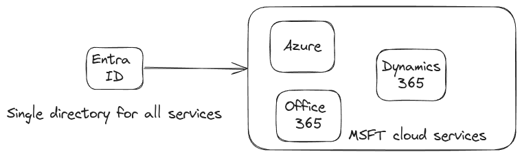


## Key Points

- Tags and Lock can be assigned at levels down from Subscription
- Security Admin role is for Azure Defender
- User Access Admin role can manage RBAC
- **Entra**
  - If AD sync is enabled, attributes cannot be modified in Entra. Can only be modified in AD
  - Usage Location can be modified in Entra
- **Availability Sets**
  - Fault Domains: max 3
  - Update Domains: max 20
- `SetupComplete.cmd` batch file in `%windir%\setup\scripts` directory will run on Startup
- `Add-AzVhd` uploads a VHD image to Azure

## Fundamentals

### Regions & Availability Zones

Azure regions are each paired with another region in the same country (e.g., AU Central 1 and AU Central 2).

- **Zonal**: deployed to an AZ
- **Zone-redundant**: deployed to multiple AZs

### Resource Groups

- Resources must be in 1 Resource Group
- Resource Group is in a Region; resources from other regions CAN be in a Resource Group
- RGs are not hierarchical
- Resources can be moved across RGs
- RG is ONLY a logical group; physical resources can communicate across Resources in RG
- Indicate resources to have the same lifetime
- Can assign permissions (RBAC) to a RG which are inherited by Resources
- Apply policies to RG → inherited by Resources
- Apply budget to RG → inherited by Resources
- Tags aren't automatically inherited from RG → Resource

### Subscriptions

- Smallest billing model/unit/boundary
- Subscription associated to/trusts ONLY 1 Azure AD
- Can assign permissions (RBAC) to a Subscription which are inherited by RGs → Resources
- Apply policies to Subscription → inherited by RGs → Resources
- Apply budget to Subscription → inherited by RGs → Resources
- Subscription has limits (similar to AWS resource Quotas)

**When to use multiple subscriptions:**
- Different environments
- Different billing requirements
- Different limits
- Security isolation

### Management Group

- MG allows creating groups of Subscriptions
- Policies, Budgets, RBAC can be associated to MGs similar to Subscriptions and they inherit down

### Virtual Network (vNet)

- Subnets span AZs
- 5 IPs of each subnet are reserved:
  - 2 DNS
  - Lowest and highest of the range
  - 1 for GW
- By default Internet access is available from a vNet
- vNets can be peered as long as CIDRs don't overlap

#### On-Premises to vNet

Needs a VPN GW in a subnet.

**Options to implement:**

**Site-to-Site VPN:**
- **Policy based VPN**: suitable for legacy; static, single connection
- **Route based VPN**: supports Express Routes and Point-to-Site VPN (Client VPN)

**Express Route:** Private link to Azure backbone via Meet Me sites
- **Private Peering**: Express Route GW is created in the Subnet; Transitive routing is supported (e.g., Express Route to vNet A can talk to vNet B if A and B are peered)
- **Microsoft Peering**: When Private Link needs to talk to non-vNet resources

#### Service Endpoints

Trust subnets to Azure services (e.g., Storage Account)

#### Private Endpoints

Private IP to Azure service

### Storage Accounts

- Are created in a region

**Types:**
- Standard: General Purpose
- Premium types:
  - Page Blob
  - Block Blob
  - File share

#### Redundancy Levels

- **LRS** - Local Redundant: 3 copies in single AZ
- **ZRS** - Zone Redundant: 3 copies in 3 AZs
- **GRS** - Geo Redundant: 3 copies in 1 AZ in region and replicated to paired region
- **GZRS** - Geo-Zone Redundant: 3 copies in 3 AZs in region and replicated to paired region

Standard: has all redundancy levels
Premium: has LRS and ZRS only

#### Blob Storage

- Premium SSD
- Standard SSD
- Standard HDD
- Ultra Disk (SSD): IOPS, Throughput can be custom set
- SMB
- NFS

#### Queue

- FIFO queue

#### Tables

- Key/Value schema-less storage

### Databases

- **Azure SQL DB**: Managed, doesn't run in your vNet, multi-tenanted
- **Azure SQL Managed Instance**: Managed, runs in your vNet. Has more compatibility features with MSSQL standalone (e.g., SQL Agent, use CLR)

#### Azure Managed Databases

- PostgreSQL
- MySQL
- MariaDB

#### DB Hyperscale

Multiple servers share load by sharding data. Azure SQL DB has hyperscale.

#### Cosmos DB

Born in the cloud, suitable for 'cloud' apps. Supports multiple data models (all NoSQL):
- Document
- Column
- Table (key/value)

## Certificates

### Administrator Associate

#### Learning Path

- https://learn.microsoft.com/en-us/plans/50nrtozg28d354
- https://learn.microsoft.com/en-us/credentials/certifications/azure-administrator/?practice-assessment-type=certification

#### Cloud Shell

Browser accessible AZ CLI with PowerShell modules:

```bash
yourname@Azure:~$ ls
clouddrive
```

- Has an inbuilt editor: VS Code
- When you open a Cloud Shell session, a temporary host is allocated to your session with the latest versions of PowerShell and Bash
- **Azure CloudDrive**: storage of Cloud Shell

**Not suitable for:**
- Long running scripts (terminates after 20 mins of inactivity)
- No `sudo`
- Multi-region storage
- Multiple sessions (only 1 can be active at one time)

#### Required Familiarity

- [[bash]]
- [[Powershell]]

#### Azure Advisor

Free service built into Azure that provides recommendations on high availability, security, performance, and cost.

#### Entra ID


**Entra Connect**: sync AD DS to Entra ID
- Sync: agent runs on AD DS
- Cloud Sync: agent runs on Azure

Entra can provide identity for all MSFT services (not just Azure).


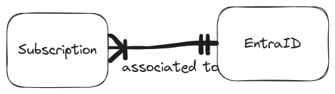

**Key facts:**
- An Azure subscription must be associated with one, and only one, Microsoft Entra tenant
- The same Microsoft Entra tenant can be associated with multiple Azure subscriptions
- Free tier automatically provisioned when creating a new subscription

**Applications and ServicePrincipals:**
- **Application**: definition of an application
- **ServicePrincipal**: Application instance in Entra ID
- Application can be defined in one tenant and used across multiple tenants by defining ServicePrincipals in each tenant

#### Entra Tiers

- **Free**
- **P1**
  - Supports self-service password writeback
  - MFA
  - 99.9% SLA
  - Conditional Access based on device, group, location
  - Advanced security reports and alerts
- **P2**
  - Risk based access
  - Privileged Identity Management (e.g., permanent and temporary administrators)

#### Entra ID vs AD DS

| AD DS                                      | Entra ID                                                               |
| ------------------------------------------ | ---------------------------------------------------------------------- |
| Is a directory service and uses Windows VM | Identity service for internet-based applications                       |
| Uses LDAP for querying                     | Uses REST API                                                          |
| Uses Kerberos for Authentication           | Uses SAML, WS-Federation, OpenID Connect for authn and OAuth for authz |
| Uses OUs and GPOs (Group Policy Objects)   | Uses users and groups in a flat structure                              |

[Reference](https://learn.microsoft.com/en-us/training/modules/understand-azure-active-directory/3-compare-azure-active-directory-domain-services)

#### Application Authentication in Cloud

**Options:**
1. Using On-premises AD
   - On-prem to Cloud VPN and use On-prem AD
   - AD replication in the cloud
2. Entra Domain Services (P1/P2) - fully compatible with AD DS

**Scenario:**
1. Create a Microsoft Entra tenant and enable Microsoft Entra Domain Services
2. Deploy a virtual network between its on-premises resources and the Microsoft Entra tenant
3. Enable Microsoft Entra Domain Services for this virtual network so that all on-premises users and services can use domain services from Microsoft Entra ID

#### Enterprise Desktop

AutoPilot joins device to Entra ID and enrolls in Intune.

{height=278, width=370}

- **Known-Folder-Move (KFM)**: can migrate local data to cloud
- **User-State-Migration-Tool (USMT)**: migrate user state (account, files, app settings), can be used for PC replacement and migrations
- **Microsoft Intune Suite**: for asset inventory

#### Identity Management

##### Users

**Identity types:**
- **Cloud**: exist only in Entra ID
  - Source: Microsoft Entra ID or External Microsoft Entra directory
- **Directory synced**: from on-premises AD
  - Source: Windows Server AD
- **Guests**
  - Source: Invited User

[Assign licences](https://learn.microsoft.com/en-us/training/modules/create-configure-manage-identities/3-exercise-assign-licenses-users)

- Deleted users remain suspended for 30 days during which user can be restored. Afterwards, they are permanently deleted
- [Example](https://learn.microsoft.com/en-us/training/modules/create-configure-manage-identities/4-exercise-restore-remove-deleted-users)

##### Groups

**Group types:**
- Security Groups
- Microsoft 365 Groups

**Membership Type:**
- **Assigned**: users are manually added
- **Dynamic User**: users are added based on rules
- **Dynamic Device**: 2 ways to associate with Entra
  - "Registered": personal device (BYOD)
  - "Joined": enterprise owned device - complete control - shown as computer objects in Entra

[Example](https://learn.microsoft.com/en-us/training/modules/create-configure-manage-identities/6-exercise-add-groups-azure-active-directory)

##### Admin Units (AU)

- Can add Users or Groups to Admin Units
- Can grant Roles at AU level (as a safety feature, Roles added to Groups do not get extended to Users in a Group)

##### External Collaboration

External collaboration settings let you specify which roles in your organization can invite external users for B2B collaboration.

### Management Groups

Can be used for:
- RBAC
- Policies
- Budget

### Cost Management

- **Hybrid Benefit**: Reduce cost when on-premises licences are available
- **Azure Reservations**: specific service/region
- **Savings Plans**: flexible compute

### Policy

**Effects:**
- Audit
- Deny
- (See image)


**Initiative**: a collection of Policies

### Locks

- Virtual machines, subscriptions, and resource groups support locks
- Management groups or storage account data do NOT support locks

**Two types of lock:**
- CANNOTDELETE
- READONLY

Applies to the **control plane** not at the **data plane**.

### VNET Details

5 IPs are reserved:
- .0: Network Address
- .1: AZ GW
- .2 and .3: DNS
- .255: broadcast

#### Peering

**Hub and Spoke:**

Hub end of the peer:


Spoke end of the peer:
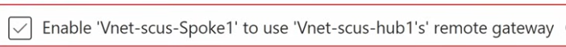

Spokes are not transitive. Add an Azure Firewall and configure it to do spoke-to-spoke routing.

#### VNET Manager

Makes network peers easy between vNETs.

**Configuration:**
- Create network groups (static and dynamic)

{height=160, width=240}

**Override NSG rules:**
- Security Admin Rules

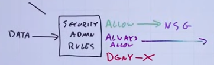

#### NSG

**Source:**
- IP
- Service Tag (Azure services)
- Application Security Group
  - Tag an application NIC
  - {{video https://youtu.be/0Knf9nub4-k?t=5677}}

### Azure Firewall

**Rules:**
- DNAT
- SNAT
- L4 Rules
- L7 Rules

**SKU:**
- **Basic**
- **Standard**
  - Web content filtering
  - Custom DNS
- **Premium**
  - TLS in/out termination
  - URL filtering

Needs UDR to send traffic to Firewall.

### DNS

- **Public zone**
- **Private zone**
  - vNET auto-register allows automatic registration of DNS names of resources (e.g., VM)

**Azure DNS**: 168.63.129.16 (only accessible from vNET)

**Azure Private DNS resolver**: access Azure DNS from on-premises

### On-Premises to Azure Connectivity

#### VPN

- **Policy based** (legacy)
- **Route based** (recommended)

#### Express Route

- **Private peering**: Connect on-premises to vNET
- **Microsoft peering**: Connect on-premises to Azure PaaS (e.g., O365)
- **Global reach**: Connect multiple on-premises sites via Azure backbone

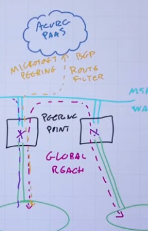

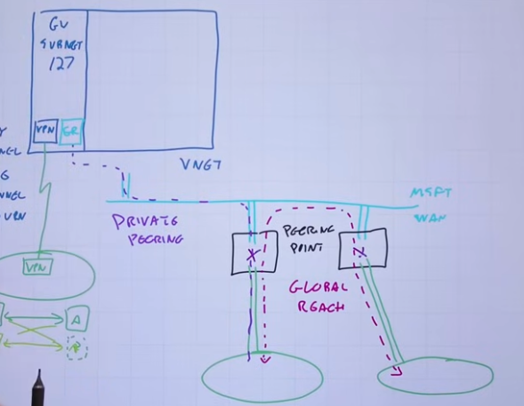{height=465, width=589}

### Virtual WAN

Simplifies on-premises to Azure connectivity.

**SKUs:**
- **Basic**
  - S2S VPN
- **Standard**
  - Express Route
  - P2S
  - S2S

### Service Endpoints

vNET accessible endpoint to Services (e.g., Storage Account).

PaaS service is still separate to your vNet, and traffic is leaving your virtual network to access the PaaS service. However, the PaaS service is configured to be able to identify traffic coming from your virtual network.

Traffic still routed via internet.

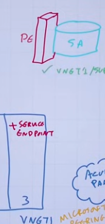

### Private Endpoints

A private NIC of the PaaS is attached to a vNET.

Can be used for own services not just PaaS.

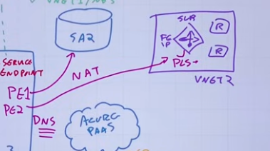

### Bastion

**SKUs:**
- Basic
- Developer: Access peered vNETs
- Standard

### Load Balancer

#### Regional Load Balancers

**App GW (L7):**
- WAF can be added
- SSL termination
- Listener types:
  - Basic: single FQDN
  - Multi-site: multiple FQDN

**Azure LB (L4)**

#### Global Load Balancers

- **Traffic Manager**: DNS based routing
- **Cross-region Load Balancer**: L4
- **Azure Front-door**: L7
  - WAF can be added

### Storage Account

**SKU:**
- GPV2
- Premium

**Types:**
- Blob
- File
- Table
- Queue

#### Redundancy

Minimum 3 copies always:

- **LRS**: 3 copies in same AZ in region
- **ZRS**: 3 copies spread in AZs in region
- **GRS**: 3 copies in one AZ in region A and 3 copies in one AZ in region B
- **GZRS**: 3 copies spread in one AZ in region A and 3 copies in one AZ in region B

**READ_ACCESS** modifier allows reading from replicated region.

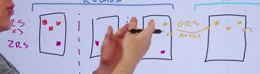

#### Access Methods

- Portal
- Storage Explorer
- `AzCopy` CLI
- Data Box / Disk: large scale data migrations
- Data Factory: ETL process

#### Blob Storage

**Tiers:**
- Hot
- Cool
- Cold
- Archive (offline - not accessible)

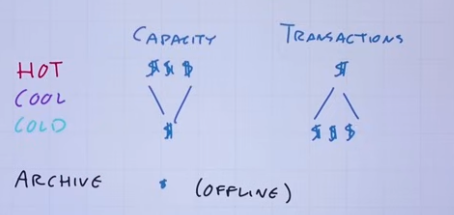

**Object Replication:**
- Can copy object to any region not just the paired region (which is the case in GRS/GZRS)
- Before configuring object replication:
  - Enable blob versioning for both storage accounts
  - Enable the change feed for the source account

**Immutability Policies:**
- A timed-based retention policy or legal hold policies can be applied to block deletion
- Immutability policies can be scoped to a blob version or to a container

#### File Storage

**Tiers:**
- Transaction optimised
- Hot
- Cool
- Premium

**FileSync:**
- Replicate on-premises → Cloud

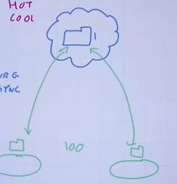

#### Shared Access Signature

Generated using Access Keys. Can be applied at granular levels.

#### Encryption

- Platform Managed Key
- Customer Managed Key
- Encryption Scopes: can be applied at container levels

#### Managed Disks

Belongs to a Storage Account.

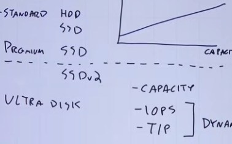

**Encryption:**
- "Disk Encryption Set" uses keys in Key Vault
- OS level encryption:
  - BitLocker (Windows)
  - DM-Crypt (Linux)

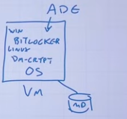

### Virtual Machine

**Scaling Profile:**
- VM template
- min/max
- scale rules

### Containers

#### Azure Container Instances

#### AKS

**Control Plane**: Managed

**Node Pools**

**Networking:**
- Kubenet (not popular)
- Azure CNI (Pod and Nodes share same IP space)
- Overlays (Uses own CIDR)

**Scaling:**
- HorizontalPodAutoscalar (HPA)
- KEDA: better than HPA
- ClusterAutoScalar

### App Service

- **App Service Plan**: dedicates capacity (e.g., Node Pool)
- Multiple apps can be deployed to same Plan

### Logging

Needs to be enabled via Diagnostic Settings.

**Can be sent to:**
- Storage
- Event Hub
- Analytics Workspace

**Retention:**
- Analytics Logs: 30, 60 days up to 2 years
- Basic Logs: 8 days retention

### Alerts

**Processing Rules:**
- Suppress
- Action Group

### Network Watcher

- View topology
- IP flow verify
- Packet Capture
