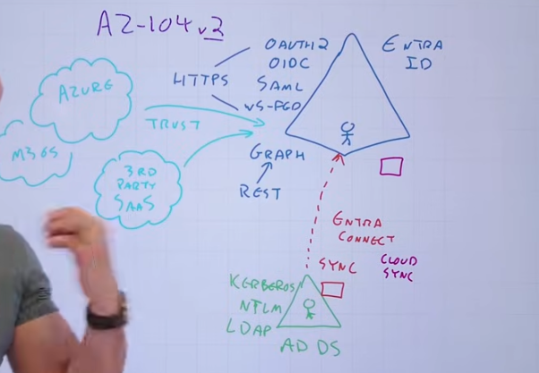
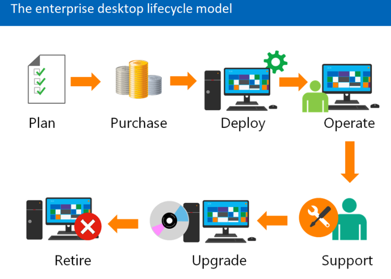
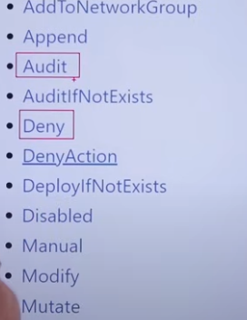

- MSFT services
  id:: 678f2fc3-d022-4a91-bdb4-ebd39d2ba0dd
  [[draws/2025-01-21-16-25-26.excalidraw]]
- ## Fundamentals
	- **Regions/AZs**
		- Azure regions - each region is paired with another in the same country e.g. AU Central 1 and AU Central 2.
			- Zonal - deployed to an AZ
			- Zone-redundant - deployed to multi-az
			- **Resource Groups**
				- Resources must be in 1 Resource Group
				- Resource Group is in a Region. Resources from other regions CAN in a Resource Group
				- RGs are not hierarchical
				- Resources can be moved across RGs
				- RG is ONLY a logical group. Physical resources can communicate across Resources in RG
				- Indicate resources to have the same lifetime
				- Can assign permissions (RBAC) to a RG which are inherited by Resources
				- Apply policies to RG > inherited by Resources
				- Apply budget to RG > inherited by Resources
				- Tags aren't automatically inherited from RG > Resource
			- **Subscriptions**
				- Smallest billing model/unit/boundary
				- Subscription associated to/trusts ONLY 1 Azure AD
				- Can assign permissions (RBAC) to a Subs which are inherited by RGs > Resources
				- Apply policies to Subs > inherited by RGs > Resources
				- Apply budget to Subs > inherited by RGs > Resources
				- Subscription has limits (similar to AWS resource Quotas)
				- Why/when to use subscriptions -- similar to AWS account
				- Different environments
				- Different billing req
				- Different limits
				- Security isolation
			- **Management Group**
				- MG allows to create groups of Subscriptions
				- Policies, Budgets, RBAC can be associated to MGs similar to Subscriptions and they inherit down
			- **vnet**
				- Subnets span Azs
				- 5 Ips of each subnet are reserved
					- 2 DNS
					- Lowest and highest of the range
					- 1 for GW
				- By default Internet access is available from a vnet
				- Vnets can be peered as long as CIDRs don't overlap
				- **On-prem to vnet**
					- Needs a VPN GW in a subnet.
					- Options to implement:
						- Site-2-site VPN:
							- Policy based VPN: suitable for legacy; static, single connection - not very useful
							- Route based VPN: supports **Express Routes** and Point-2-site VPN (Client VPN)
						- Express Route: Private link to Azure backbone via Meet Me sites
							- Can peer with a vnet using
								- Private Peering: Express Route GW is created in the Subnet, Transitive routing is supported e.g. Express Route to vnet A can talk to vnet B if A and B are peered
								- Microsoft Peering: When Private Link needs to talk to non-vnet resources e.g.
			- **Service Endpoints**
				- Trust subnets to Azure services e.g. Storage Account
			- **Private Endpoints**
				- Private IP to Azure service
			-
			- **Storage Accounts**
				- Are created in a region
				- Types:
					- Standard: General Purpose
					- Premium types:
						- Page Blob:
						- Block Blob:
						- File share
				- **Redundancy levels**
					- LRS - local redundant: 3 copies in single AZ
					- ZRS - zone redundant: 3 copies in 3 AZs
					- GRS - geo redundant: 3 copies in 1 AZ in region and replicated to paired region
					- GZRS - geo-zone redundant: 3 copies in 3 AZs in region and replicated to paired region
					- Standard: has all redundancy levels  
					  Premium: has LRS and ZRS only
				- **Blob**
					- Premium SSD
					- Standard SSD
					- Standard HDD
					- Ultra Disk (SSD): IOPS, Throughput can be custom set
					- SMB
					- NFS
				- **Queue**
					- FIFO queue
				- **Tables**
					- Key/Value schema-less storage
				-
			- **Databases**
				- Azure SQL DB: Managed, doesn't run in your vnet, multi-tenanted
				- Azure SQL Managed Instance: Managed, runs in your vnet. Has more compatibility features with MSSQL standalone e.g. SQL Agent, use CLR
				- **Azure Managed DB**
					- Postgres
					- Mysql
					- MariaDB
				- **DB Hyperscale**
					- Multiple servers share load by sharding data
					- Azure SQL DB has hyperscale**
				- **Cosmos DB**
					- Born in the cloud, suitable for 'cloud' apps
					- Supports multiple data models (all no-SQL)
						- Document
						- Column
						- Table (key/value)
-
- ## Certificates
	- ### Administrator Associate
		- #### Learning path
			- https://learn.microsoft.com/en-us/plans/50nrtozg28d354
			- https://learn.microsoft.com/en-us/credentials/certifications/azure-administrator/?practice-assessment-type=certification
		- #### Cloud Shell
			- Browser accessible AZ CLI with Powershell modules
			  ```
			  yourname@Azure:~$ ls
			  clouddrive
			  ```
			- Has an inbuilt editor - VS Code
			- When you open a Cloud Shell session, a temporary host is allocated to your session. This VM is preconfigured with the latest versions of PowerShell and Bash.
			- **Azure CloudDrive** - storage of Cloud Shell
			- Not suitable for
				- long running scripts (terminates after 20mins of inactivity)
				- no `sudo`
				- multi-region storage
				- multiple sessions - only 1 can be active at one time
		- **Familiarity with**
			- [[bash]]
			- [[Powershell]]
		- #### Azure Advisor
			- Free service built into Azure that provides recommendations on high availability, security, performance, and cost
		- #### Entra ID
			- 
			- Entra Connect: sync AD DS to Entra ID
				- Sync (agent runs on AD DS)
				- Cloud Sync (agent runs on Azure)
			- Can provide identity for all MSFT services (not just Azure) {{embed ((678f2fc3-d022-4a91-bdb4-ebd39d2ba0dd))}}
			- Free tier automatically provisioned when creating a new subscription
			- [[draws/2025-01-21-15-07-45.excalidraw]]
			- At any given time, ==an Azure subscription must be associated with one, and only one, Microsoft Entra tenant==
			- ==You can associate the same Microsoft Entra tenant with multiple Azure subscriptions==
			- Applications and ServicePrincipals are its own classes
				- Application: definition of an application
				- ServicePrincipal: Application instance in EntraID
				- Application can be defined in one tenant and used it across multiple tenants by defining ServicePrincipals in each tenant
			- Entra tiers
				- Free
				- P1
					- Supports self-service password writeback
					- MFA
					- 99.9% SLA
					- Conditional Access based on device, group, location
					- Advanced security reports and alerts
				- P2
					- Risk based access
					- Privileged Identity Management e.g., permanent and temporary administrators
					-
		- #### Entra ID vs AD DS
			- [docs](https://learn.microsoft.com/en-us/training/modules/understand-azure-active-directory/3-compare-azure-active-directory-domain-services)
			  |AD DS|Entra ID|
			  |--|--|
			  |Is a directory service and uses Windows VM|Identity service for internet-based applications|
			  |Uses LDAP for querying| Uses REST API|
			  |Uses Kerberos for Authentication| Uses SAML, WS-Federation, OpenID Connect for authn and OAuth for authz|
			  |Uses OUs and GPOs (Group Policy Objects)|Uses users and groups in a flat structure|
		- #### Application authentication in Cloud
			- Options:
				- Using On-prem AD
					- On-prem to Cloud VPN and use On-prem AD
					- AD replication in the cloud
				- Entra Domain Services (P1/P2) - this is fully compatible with AD DS
			- Scenario:
				- Create a Microsoft Entra tenant and enable Microsoft Entra Domain Services
				  logseq.order-list-type:: number
				- Deploy a virtual network between its on-premises resources and the Microsoft Entra tenant.
				  logseq.order-list-type:: number
				- Enable Microsoft Entra Domain Services for this virtual network so that all on-premises users and services can use domain services from Microsoft Entra ID.
				  logseq.order-list-type:: number
		- **Enterprise Desktop**
			- AutoPilot joins device to Entra ID and enrolls in Intune
			- {:height 278, :width 370}
			- Known-Folder-Move (KFM) - can migrate local data to cloud
			- User-State-Migration-Tool (USMT) -  migrate user state (account, files app settings), can be used for PC replacement and migrations
			- **Microsoft Intune Suite** - for asset inventory
		- #### Identity management
			- Users
				- Identity types
					- Cloud - exist only in Entra ID
						- source: **Microsoft Entra ID** or **External Microsoft Entra directory**
					- Directory synced (from on-prem AD)
						- source: **Windows Server AD**
					- Guests
						- source: **Invited User**
				- [Assign licences](https://learn.microsoft.com/en-us/training/modules/create-configure-manage-identities/3-exercise-assign-licenses-users)
				- Deleted users remain suspended for 30 days during which user can be restored. Afterwards, they are permanently deleted [Example](https://learn.microsoft.com/en-us/training/modules/create-configure-manage-identities/4-exercise-restore-remove-deleted-users)
			- Groups
				- Group types
					- Security Groups
					- Microsoft 365 Groups
				- Membership Type [Example](https://learn.microsoft.com/en-us/training/modules/create-configure-manage-identities/6-exercise-add-groups-azure-active-directory)
					- Assigned - users are manually added
					- Dynamic User - users are added based on rules
					- Dynamic Device - 2 ways to associate with Entra
						- "Registered" - personal device (BYOD)
						- "Joined" - enterprise owned device - complete control - these are shown as computer objects in Entra
			- Admin Units (AU)
				- Can add Users or Groups to Admin Units
				- Can grant Roles at AU level (as a safety features the Roles added to Groups do not get extended to Users in a Group)
		- #### Management Groups
			- Can be used to
				- RBAC
				- Policies
				- Budget
		- #### Cost Management
			- Hybrid Benefit - Reduce cost when on-prem licences are available
			- Azure reservations - specific service/region
			- Savings Plans - flexible compute
		- #### Policy
			- Effects
				- Audit
				- Deny
				- ...
				  
			- **Initiative** is a collection of Policies
		- #### Locks
			- virtual machines, subscriptions, and resource groups support locks
			- management groups or storage account data do NOT support locks
		-
-
-
-
-