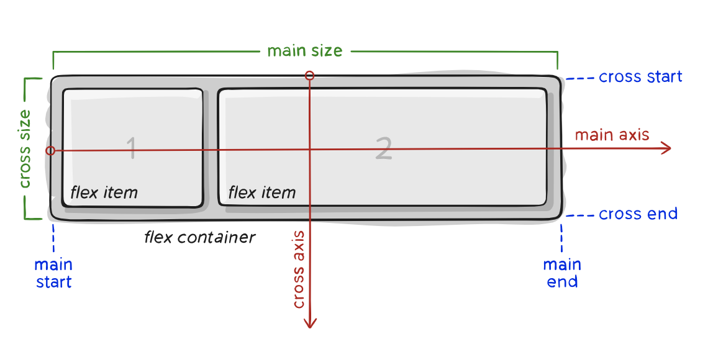
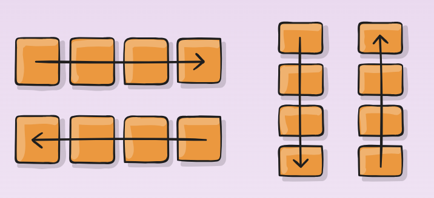
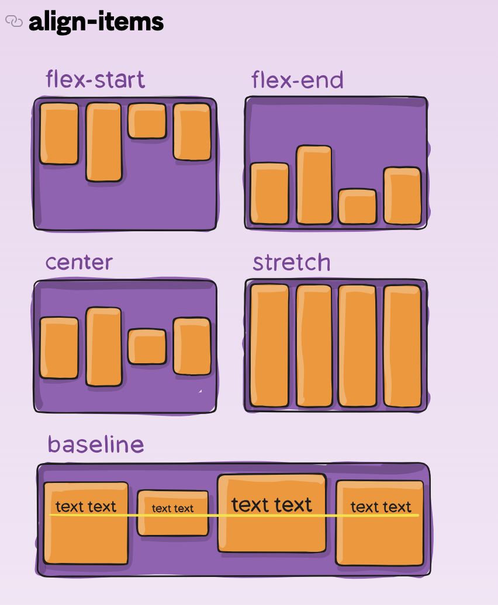
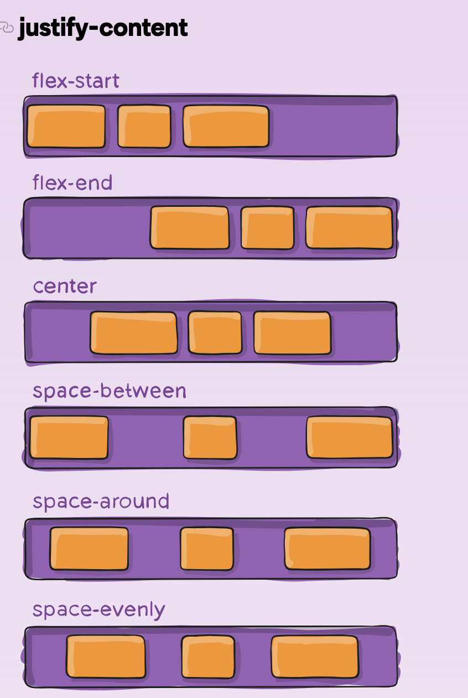

# CSS

## Flexbox

### Reference

[A Guide to Flexbox - CSS Tricks](https://css-tricks.com/snippets/css/a-guide-to-flexbox/)

### Flexbox Basics

#### Flex Container

An area of a document that is laid out using flexbox is called a **flex container**. To create a [flex container](https://developer.mozilla.org/en-US/docs/Glossary/Flex_Container), set the area's [`display`](https://developer.mozilla.org/en-US/docs/Web/CSS/display) property to `flex`.

#### Flex Items

In a flex container, the direct children of that container become **flex items**.

### Flexbox Properties

#### flex-direction

Controls the direction of flex items:
- `row` (default): left to right
- `column`: top to bottom

#### align-items

Defines the default behavior for how flex items are laid out along the **cross axis** on the current line.

#### justify-content

Defines the alignment along the **main axis**.

