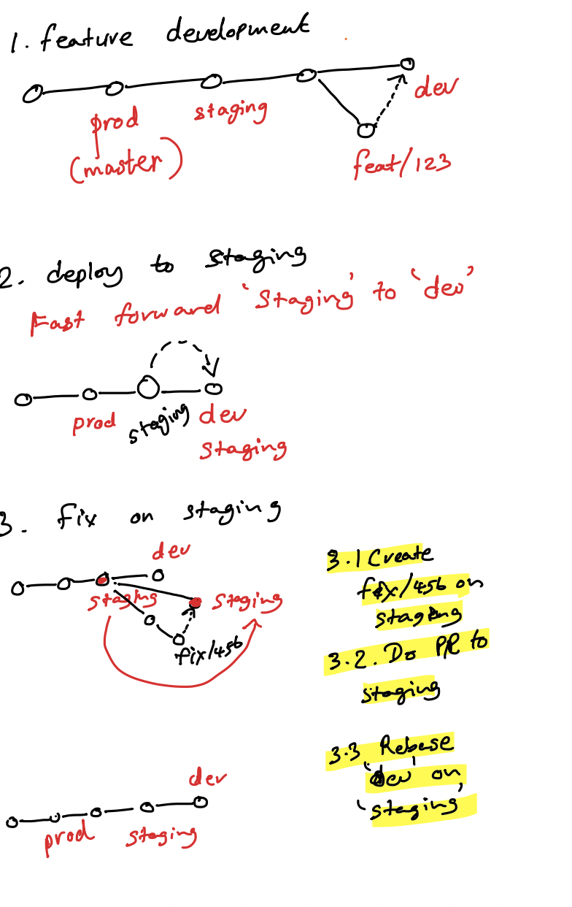

- Ignore tracked files
  `git update-index --assume-unchanged [<file> ...]`
- To undo and start tracking again
  `git update-index --no-assume-unchanged [<file> ...]
- show changes in commit  
  `git show <commit>`
-
- ### submodules
	- add submodule
	  `git submodule add git://…`
	- clone project with submodules
	  `git clone git://…`
	- checkout submodule code
	  
	  `git submodule update --init`
	  or
	  `git clone --recurse-submodules git://…`
	- git pull and submodule update together
	  `git pull --recurse-submodules`
	- get upstream changes
	  ```
	  # change to submod directory and run
	  git pull origin master
	  
	  # Or from main project
	  git submodule update --remote --recursive
	  ```
	- get diff of submodule
	  `git diff --submodule`
- ### logs
	- Example
	  ```
	      1-2 A  
	     /  
	  0-0-5-3-4 B
	  ```
	  ``
	- commits only in B  
	  ```
	  $ git log A..B  
	  3  
	  4
	  ```
	- commits in A and B  
	  ```
	  
	  $ git log A...B  
	  1  
	  2  
	  3  
	  4
	  ```
	- changes on a specific file  
	  `git log --follow <filename>`
	- only file names
	  `git log --name-only`
	  
	  ```
	  ### log graph  
	  $ git log --graph --oneline --decorate --all
	  
	  # only filenames  
	  
	  
	  $  git log --graph --oneline --all --decorate  
	  * 904ed93 (HEAD -> feat) b1  
	  * 0a642d0 (master) m3  
	  * 339c07f m2  
	  * 3e13e66 m1
	  
	  
	  
	  # list branches  
	  git branch -a # all  
	  git branch -r # remote  
	  git branch # local
	  
	  # common ancestor in two branches (branch point)  
	  $ git merge-base A B  
	  5
	  
	  ### fast-forward  
	  0 - 0 - 0         <- master  
	         \  
	          0 - 0   <- feature
	  
	  git checkout master  
	  git merge feature                  
	  
	  0 - 0 - 0          
	         \  
	          0 - 0   <- feature <- master
	  
	  ### rebase
	  
	  $  git log --graph --oneline --all  
	  * 0a642d0 (master) m3  
	  | * 9203bad (HEAD -> feat) b1  
	  |/  
	  * 339c07f m2  
	  * 3e13e66 m1
	  
	  $ git checkout feat  
	  Switched to branch 'feat'
	  
	  $ git rebase master  
	  First, rewinding head to replay your work on top of it...  
	  Applying: b1
	  
	  ### config  
	  [format]  
	        pretty=format:"%C(auto)%h %an %ad %d %s"        
	  
	  ### cleanup  
	  # revert changes on local copy  
	  git checkout .         
	  
	  # delete untracked files  
	  git clean -f
	  
	  # delete untracked dir  
	  git clean -d
	  
	  # delte branch  
	  git branch -D feat  
	  git push origin :feat # delete remote  
	  git push origin --delete feat
	  
	  ## undo last commit  
	  git reset --hard HEAD~1
	  
	  ## revert merge commit  
	  git revert -m 1 <commit>
	  
	  
	  ### branching  
	  # move branch to an old commit  
	  git branch -f branch-name new-tip-commit  
	  git push -f origin branch-name
	  
	  q
	  
	  # merged branches to the current  
	  git branch --merged | egrep -v "(^\*|master|develop)
	  
	  # delete local branch  
	  git branch --delete <branch>
	  
	  # delete remote tracking branch  
	  git branch -dr origin/<branch>
	  
	  # delete remote branch  
	  git push origin --delete <branch>
	  
	  # do all the above  
	  for i in `git branch --merged | egrep -v "(^\*|master|develop)"`; do git branch --delete $i; git branch -dr origin/$i; git push origin --delete $i; done
	  
	  ### rename  
	  git branch -m old_branch_name new_branch_name  
	  git push -u origin new_branch_name
	  
	  # delete old branch in remote  
	  git push origin :old_branch_name
	  ```
- ## GitLab flow
- 