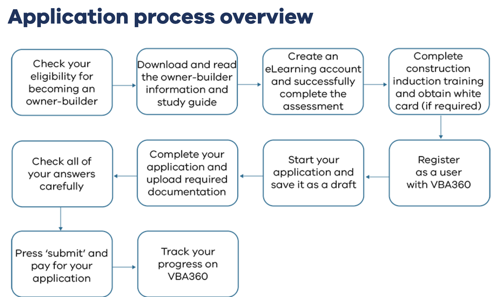

- 
- 
- # Owner Builder
  - ## Risks
    - **Financial** ((6780dd8b-ce32-40a6-8e20-a257378b6eca))
    - **Quality** ((6780ddd9-b659-40f7-b077-809c5b12c722))
    - **Time** ((6780ddf8-0960-43c3-879e-005352a87e16))
    - **Future** ((6780de0f-fac5-4ca4-904a-86cab6bb2952))
      - ==Cost of insurance when selling==
  - ## Reduce risks
    - ((6780de53-898e-4bde-94e9-e8c16a12e88f))
  - ## Requirements
    - Planning permit - ==required== logseq.order-list-type:: number
      - https://www.vic.gov.au/planning-and-building-permits
        logseq.order-list-type:: number
        > For people rebuilding a bushfire impacted home, you will likely need a
        > planning permit.
      - logseq.order-list-type:: number
    - Building permit - ==required== logseq.order-list-type:: number
      - Reference
        [VBA](https://www.vba.vic.gov.au/consumers/home-renovation-essentials/permits)
        logseq.order-list-type:: number
      - Apply
        [Mitchell Shire - building permits](https://www.mitchellshire.vic.gov.au/plan-and-build/building-services/building-permits)
        logseq.order-list-type:: number
    - Any construction > $10k ==must== have a building contract with a builder
      who is registered with VBA logseq.order-list-type:: number
    - Building surveyor ((6780fb14-b46b-4ec2-a175-47ebc1112e15))
      logseq.order-list-type:: number
    - VBA application ((6780fcb1-4e77-456b-bac7-d64c4e827acf))
      logseq.order-list-type:: number
      
- # Build
  - ## Building Permit
    - How to obtain? ((6780fe5c-a280-4d1c-8f78-0fc13b0ff8b5))
      - Issued by building surveyor
        
        
        
      - Prerequisites
        - drawings
        - specifications
        - allotment plans
