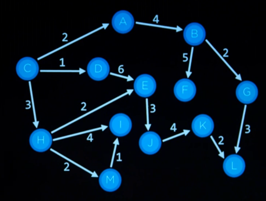

# ML

## Search

- Go from Node A to Node B in a graph
   
- Action(node) -> new node
- Algorithm:
   

  1. Start with the Frontier containing initial Node - type of Frontier determines search algorithm
  2. Select 1 from the Frontier (Queue or Stack frontier will behave differently)
  3. If selected Node == goal -> END
  4. Else Explore (apply Action to Node) selected node and
	- 1. Add new Nodes to frontier
	- 2. Add node to Explored set
- 5. Repeat 2

- Search Algorithms:
  - Breadth first search (explore siblings before traversing a branch,
    implemented using a QueueFrontier)
  - Depth first search (explore depth before traversing siblings, implemented
    using a StackFrontier)
  - Greedy best first use a heuristic function to evict a node from frontier)
      
      
      
      
      
      
    
      
    
- Path cost
  
- **Concepts**
  - **Search Algorithm**

      
      
    

    **Adverserial Search**

    
    
    
    
    
    

    O minimize value  
    X maximize value√

    
- ## Knowledge
  

  

  

