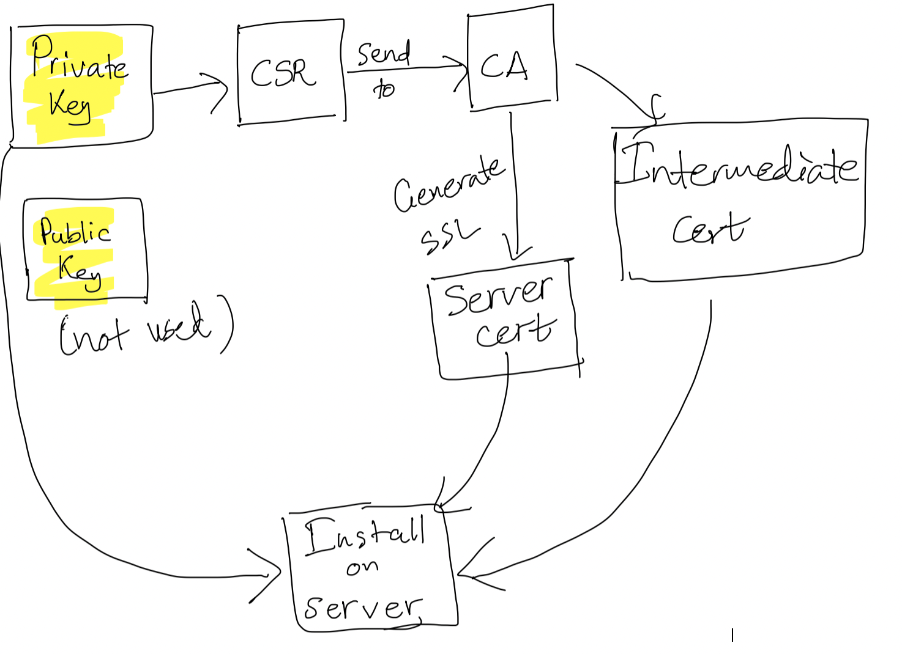

# SSL



## Self-Signed SSL

### Create self-signed certificate

```bash
openssl req -x509 -newkey rsa:4096 -keyout key.pem -out cert.pem -days 365
```

### Export decrypted private key

```bash
openssl rsa -in key.pem -out private_unencrypted.pem -outform PEM
```

### Self-signed SSL (alternative approach)

```bash
openssl genrsa -out server.key 2048
openssl rsa -in server.key -out server.key
openssl req -sha256 -new -key server.key -out server.csr -subj '/CN=localhost'
openssl x509 -req -sha256 -days 365 -in server.csr -signkey server.key -out server.crt
```

## CSR and Export PFX

### Create private key

```bash
openssl genrsa -out private.key 2048
openssl req -new -key private.key -out myopenpay.co.uk.csr
```

### Receive following files

- IntermediateCA.cer
- ssl_certificate.cer

### Verify CSR

```bash
openssl req -text -verify -in xyz.csr
```

### Export PFX

```bash
cat ssl_certificate.cer > a.cer
cat IntermediateCA.cer >> a.cer
openssl pkcs12 -export -out domain.name.pfx -inkey private.key -in a.cer
```

Note: CER files are PKCS7 format.

## Decode Certificate

```bash
openssl x509 -noout -text -in cert.crt
```

## Encoding Formats

- **Base64**
  - PEM: Base64-encoded with `---- BEGIN CERTIFICATE ----` headers
  - Container format that can hold private key or both private and public keys
  
- **Binary**
  - DER

## Verify SSL Chain

```bash
openssl verify -CAFile <root.crt> -untrusted <intermediate.crt> <server.crt>
```

## Verify Key and Certificate Match

```bash
openssl x509 -noout -modulus -in server.crt | openssl md5
openssl rsa -noout -modulus -in server.key | openssl md5
```

Compare the output of both commands - they should match if the key and certificate are paired.

## Create Key and CSR

```bash
DOMAIN_NAME=css.alinta-landing.aws.apa.local
openssl req -new -newkey rsa:2048 -nodes \
  -out ${DOMAIN_NAME}.csr \
  -keyout ${DOMAIN_NAME}.key \
  -subj "/C=AU/ST=VIC/L=Melbourne/O=APA/OU=IT/CN=${DOMAIN_NAME}" \
  -addext "subjectAltName = DNS:${DOMAIN_NAME}"
```
