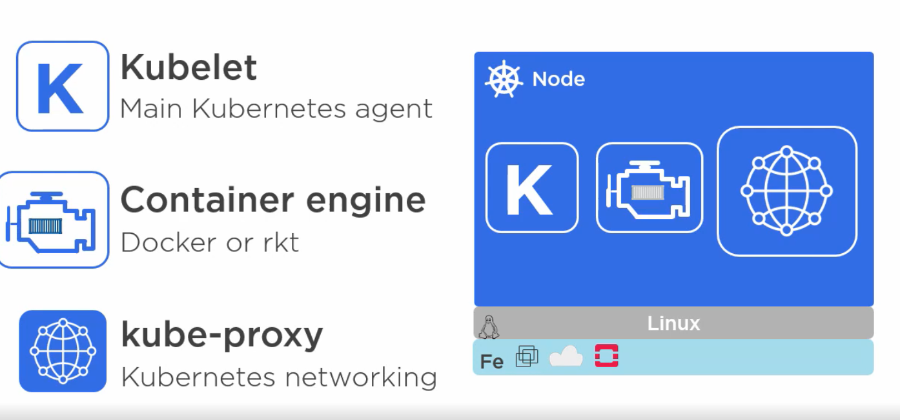
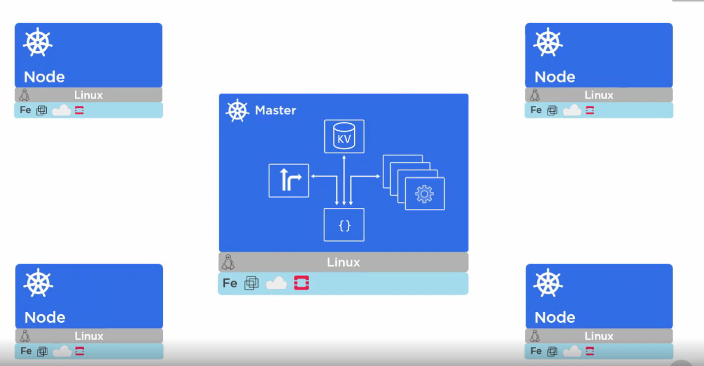
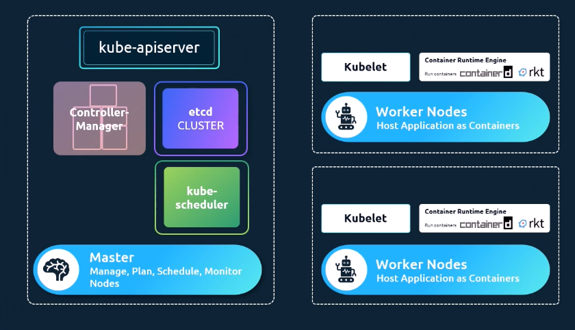

## Cheatsheet

- kubectl
  - configuration
    - Context -> cluster -> namespace -> user
- Run busybox and connect

  ==kubectl run -i --tty busybox --image=busybox --restart=Never -- sh==

  User account restrict to namespace

  [https://jeremievallee.com/2018/05/28/kubernetes-rbac-namespace-user.html](https://jeremievallee.com/2018/05/28/kubernetes-rbac-namespace-user.html)
  1. Create service account

  apiVersion: v1  
  kind: Namespace  
  metadata:  
  name: mynamespace

  ***

  apiVersion: v1  
  kind: ServiceAccount  
  metadata:  
  name: mynamespace-user  
  namespace: mynamespace

  ***

  kind: Role  
  apiVersion: rbac.authorization.k8s.io/v1beta1  
  metadata:  
  name: mynamespace-user-full-access  
  namespace: mynamespace  
  rules:

- apiGroups: ["", "extensions", "apps", "policy", "rbac.authorization.k8s.io",
  "batch"]  
  resources: ["*"]  
  verbs: ["*"]

  ***

  kind: RoleBinding  
  apiVersion: rbac.authorization.k8s.io/v1beta1  
  metadata:  
  name: mynamespace-user-binding  
  namespace: mynamespace  
  subjects:

- kind: ServiceAccount  
  name: mynamespace-user  
  namespace: mynamespace  
  roleRef:  
  apiGroup: rbac.authorization.k8s.io  
  kind: Role  
  name: mynamespace-user-full-access
  1. Get login token for service account

  ==kubectl describe sa mynamespace-user-n mynamespace======  
  ==-- find secret==  
  kubectl get secret mynamespace-user-token-7wpw7 -n mynamespace -o
  "jsonpath={.data.token}" | base64 -D
  1. Get server crt

  kubectl get secret mynamespace-user-token-7wpw7 -n mynamespace -o
  "jsonpath={.data['ca\.crt']}"

- ## Istio
- TLS config
  [https://istio.io/latest/docs/ops/configuration/traffic-management/tls-configuration/](https://istio.io/latest/docs/ops/configuration/traffic-management/tls-configuration/)
- Example:  
  [https://istio.io/latest/docs/tasks/traffic-management/ingress/secure-ingress/](https://istio.io/latest/docs/tasks/traffic-management/ingress/secure-ingress/)
=======
>>>>>>> 883edd6 (Auto saved by Logseq)
	- kubectl
		- configuration
			- Context ->  cluster -> namespace -> user
	- Run busybox and connect
	     
	  
	  ==kubectl run -i --tty busybox --image=busybox --restart=Never -- sh==
	  
	  User account restrict to namespace
	   
	  [https://jeremievallee.com/2018/05/28/kubernetes-rbac-namespace-user.html](https://jeremievallee.com/2018/05/28/kubernetes-rbac-namespace-user.html)
	      
	  1. Create service account
	   
	  apiVersion: v1  
	  kind: Namespace  
	  metadata:  
	  name: mynamespace  
	  ---  
	  apiVersion: v1  
	  kind: ServiceAccount  
	  metadata:  
	  name: mynamespace-user  
	  namespace: mynamespace
	   
	  ---  
	  kind: Role  
	  apiVersion: rbac.authorization.k8s.io/v1beta1  
	  metadata:  
	  name: mynamespace-user-full-access  
	  namespace: mynamespace  
	  rules:
	- apiGroups: ["", "extensions", "apps", "policy", "rbac.authorization.k8s.io", "batch"]  
	  resources: ["*"]  
	  verbs: ["*"]
	  
	  ---  
	  kind: RoleBinding  
	  apiVersion: rbac.authorization.k8s.io/v1beta1  
	  metadata:  
	  name: mynamespace-user-binding  
	  namespace: mynamespace  
	  subjects:
	- kind: ServiceAccount  
	  name: mynamespace-user  
	  namespace: mynamespace  
	  roleRef:  
	  apiGroup: rbac.authorization.k8s.io  
	  kind: Role  
	  name: mynamespace-user-full-access
	   
	  
	  1. Get login token for service account
	  
	  ==kubectl describe sa mynamespace-user-n mynamespace======  
	  ==-- find secret==  
	  kubectl get secret mynamespace-user-token-7wpw7 -n mynamespace -o "jsonpath={.data.token}" | base64 -D
	   
	  
	  1. Get server crt
	  
	  kubectl get secret mynamespace-user-token-7wpw7 -n mynamespace -o "jsonpath={.data['ca\.crt']}"
- ## Istio
  collapsed:: true
	- TLS config [https://istio.io/latest/docs/ops/configuration/traffic-management/tls-configuration/](https://istio.io/latest/docs/ops/configuration/traffic-management/tls-configuration/)
		- Example:  
		  [https://istio.io/latest/docs/tasks/traffic-management/ingress/secure-ingress/](https://istio.io/latest/docs/tasks/traffic-management/ingress/secure-ingress/)
-
- ## Overview
	- {:height 358, :width 748}
	- 
	-
	- **Master** node contains
		- API server
		- KV store (etcd)
		- kube-scheduler
		- controller-manager
		-
	- **Worker** node contains
		- Kubelet
			- interacts with API server
		- Container Engine (e.g. `containerd`)
		- kube-proxy
			- manages communications between pods
			- assigns IP per pod
		  - Load balances across pods in a service
			- Load balances across pods in a service
	- 
